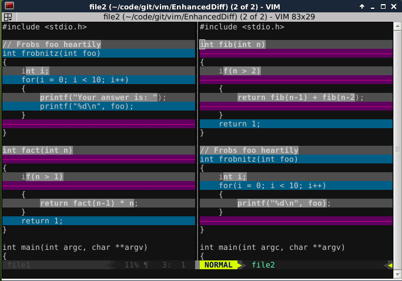
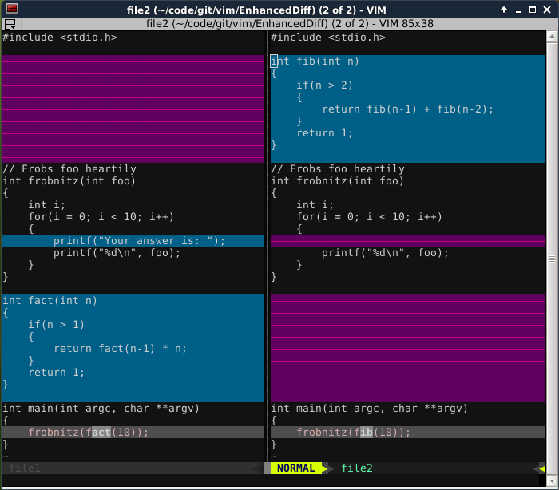
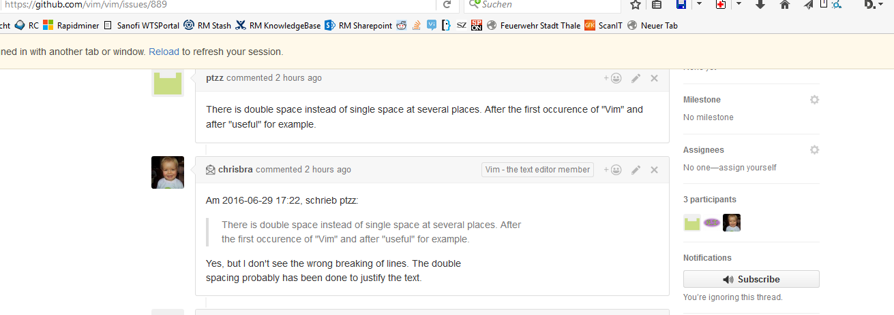

# EnhancedDiff plugin [](https://saythanks.io/to/cb%40256bit.org)
> A Vim plugin for creating better diffs (sometimes)

This plugin allows you to make use of the Patience diff algorithm for
generating diffs to use with Vim. This needs the git command line tool
available. (But see [Update below][Update])

You can also customize your setup to use any other tool to generated diffs
(e.g. mercurial) Read the help on how to configure the plugin accordingly.

Here are some screenshots that visualize how the patience/histogram algorithm
work.

This is the default diff generated by Vim:


Now change that to using the "histogram" algorithm by running `:EnhancedDiff histogram`
If Vim is in diff mode, the diff will be updated to this:



Note, that the Patience algorithm might not always provide better diffs. But
using this plugin you can at least easily switch between different diffs.

## Update 
Starting with Vim [8.1.0360][Vim_81360] Vim now comes bundled with the xdiff
library and is able to handle diff internally without falling back to
calling `diff` as external tool.

This means, one can now simply set diffopt:

    if has("patch-8.1.0360")
        set diffopt+=internal,algorithm:patience
    endif

and Vim will use the patience diff algorithm when creating a diff.

In addition, Vim can now parse context diffs (currently with only zero
context lines) from a diff tool when using diff as external tool. So a
translation to an ed-like diff is not needed anymore.

So in essence, starting with that Vim version, you don't need to use this
plugin anymore.

# Ignoring parts of a file

Using the command `:EnhancedDiffIgnorePat pat` you can define patterns, that
will be ignored before feeding the buffer contents to the diff program.
Internally this will be handled by substituting those matches with 'XX'
so that the content will look like the same for the diff binary.

This is how it looks like with a pattern of `^[^;]\+;` and `;[^;]\+$`


### Installation
Use the plugin manager of your choice:

* [Pathogen][pathogen]
  * `git clone https://github.com/chrisbra/vim-diff-enhanced.git ~/.vim/bundle/vim-enhanced-diff`
  * `:Helptags` (only needed once after the installation to install the documentation)
* [NeoBundle][neobundle]
  * `NeoBundle 'chrisbra/vim-diff-enhanced'`
* [Vundle][vundle]
  * `Plugin 'chrisbra/vim-diff-enhanced'`
* [Vim-Plug][vim-plug]
  * `Plug 'chrisbra/vim-diff-enhanced'`

Alternatively download the [stable][] version of the plugin, edit it with Vim (`vim EnhancedDiff-XXX.vmb`) and simply source it (`:so %`). Restart and take a look at the help (`:h EnhancedDiff.txt`)

[stable]: http://www.vim.org/scripts/script.php?script_id=5121

### Usage
Once installed, take a look at the help at `:h EnhancedDiff`

Here is a short overview of the functionality provided by the plugin:
#### Ex commands:
`:PatienceDiff` - Use the Patience Diff algorithm for the next diff mode

`:EnhancedDiff <algorithm>`  - Use &lt;algorithm> to generate the diff.
Use any of
* myers		Default Diff algorithm used
* default	Alias for myers algorithm
* histogram     Fast version of patience algorithm
* minimal	Default diff algorithm, trying harder to minimize the diff
* patience	Patience diff algorithm.

Note: Those 2 commands use the git command line tool internally to generate the
diffs. Make sure you have at least git version 1.8.2 installed.

`:EnhancedDiffDisable`    - Disable plugin (and use default Vim diff capabilities).

### FAQ

#### How can I enable the patience diff algorithm when starting as vimdiff / git difftool / ... ?
In that case, add this snippet to your .vimrc:
```viml
" started In Diff-Mode set diffexpr (plugin not loaded yet)
if &diff
    let &diffexpr='EnhancedDiff#Diff("git diff", "--diff-algorithm=patience")'
endif
```
### License & Copyright

© 2015 by Christian Brabandt. The Vim License applies. See `:h license`

__NO WARRANTY, EXPRESS OR IMPLIED.  USE AT-YOUR-OWN-RISK__

[pathogen]: https://github.com/tpope/vim-pathogen
[neobundle]: https://github.com/Shougo/neobundle.vim
[vundle]: https://github.com/gmarik/vundle
[vim-plug]: https://github.com/junegunn/vim-plug
[Vim_81360]: https://github.com/vim/vim/releases/tag/v8.1.0360
[Update]: https://github.com/chrisbra/vim-diff-enhanced/blob/master/README.md#update
